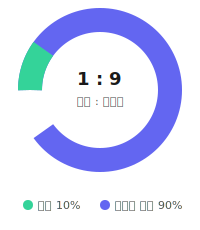

# Diary

Kotlin Multiplatform 기반의 다이어리 앱입니다.

> Vibe coding으로 만들어가는 중입니다.

  

  

## Platforms

| Android | iOS | Desktop (JVM) | Web (Wasm) |
|---------|-----|---------------|------------|
| ✅       | ✅   | ✅             | ⏸️          |

## Features

- 메모 작성
- 캘린더
- Google 로그인
- Supabase 동기화
- 날씨
- 태그
- 공휴일
- 황금연휴 찾기
- 태그 필터

## License

This project is licensed under the [GNU AGPL v3.0](LICENSE).
